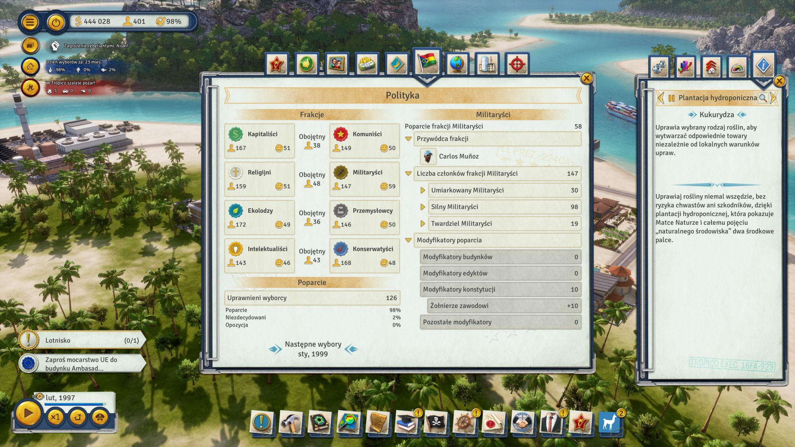
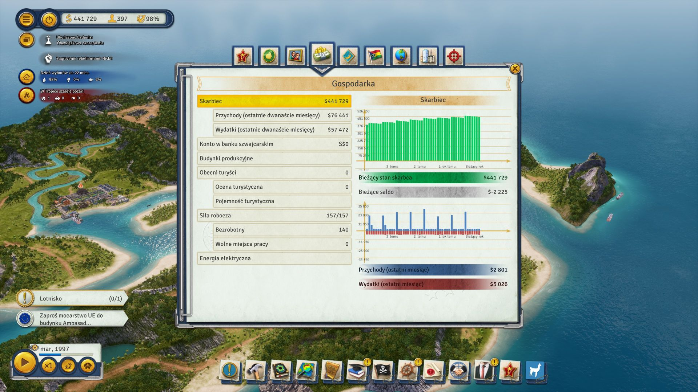
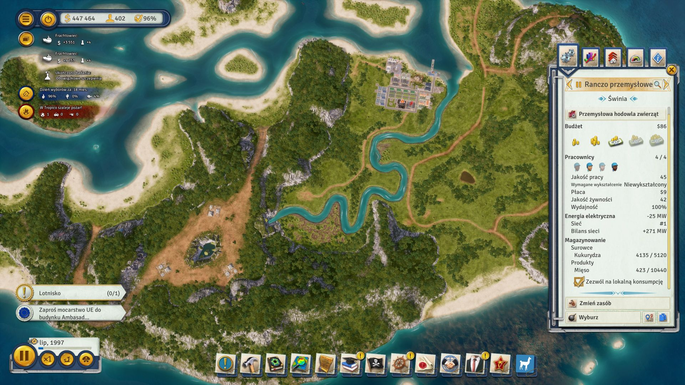

# Tropico 6 — Spolszczenie PL

Kompletne fanowskie polskie tłumaczenie gry **Tropico 6**.

Projekt obejmuje grę podstawową oraz wszystkie teksty dodatków DLC znajdujące się w aktualnych plikach lokalizacyjnych.

## 📦 Aktualne wydanie

**v1.0.0**

➡️ **[Pobierz najnowszą wersję](https://github.com/mariuszm22/Tropico6-Spolszczenie-PL/releases/latest)**

Dostępne są dwie metody instalacji:

- **EXE — instalator automatyczny (zalecany)**
- **ZIP — instalacja ręczna**

## Windows SmartScreen / instalator EXE

Windows może wyświetlić ostrzeżenie SmartScreen, ponieważ instalator EXE nie posiada komercyjnego podpisu cyfrowego. Komunikat ten nie oznacza automatycznie wykrycia wirusa. Plik można niezależnie sprawdzić w serwisie [VirusTotal — wynik dla finalnego EXE](https://www.virustotal.com/gui/file/E8B0E49D63445A7AE49649004C71BDF03BD4240D8AB22DA64C116FAC6674E46C). Jeśli nie chcesz uruchamiać EXE, dostępna jest również wersja ZIP do instalacji ręcznej.

**SmartScreen:** kliknij **„Więcej informacji”**, a następnie **„Uruchom mimo to”**.

---

## 📷 Zrzuty ekranu

<p align="center">
  
  
</p>

<p align="center">
  
  
</p>

<p align="center">
  
  
</p>

<p align="center">
  
  
</p>

<p align="center">
  
  
</p>

---

## 📋 Zawartość tłumaczenia

Spolszczenie obejmuje:

- ✅ pełną grę podstawową,
- ✅ wszystkie teksty dodatków DLC znajdujące się w aktualnych plikach lokalizacyjnych,
- ✅ menu i interfejs użytkownika,
- ✅ misje i wydarzenia,
- ✅ budynki,
- ✅ konstytucję,
- ✅ edykty,
- ✅ opisy produktów i surowców.

---

## ⚙️ Instalacja

### Instalator automatyczny — zalecany

1. Przejdź do zakładki **Releases**.
2. Pobierz:
   `marko22-Instalator-Tropico6-v1.exe`
3. Uruchom instalator.
4. Instalator automatycznie wykryje grę, sprawdzi zgodność wersji i przeprowadzi instalację spolszczenia.

Instalator umożliwia również bezpieczne odinstalowanie spolszczenia.

Jeśli gra nie uruchomi się po polsku, wybierz **język polski** w ustawieniach.

### Instalacja ręczna — ZIP

1. Pobierz:
   `Tropico6_PL_v1.0.0.zip`
2. Rozpakuj archiwum.
3. Skopiuj plik:

   ```
   Tropico6_PL_v1.0.0.pak
   ```

   do folderu:

   ```
   Tropico6\Content\Paks
   ```

4. Uruchom grę.

Jeśli gra nie uruchomi się po polsku, wybierz **język polski** w ustawieniach.

---

## 🐞 Zgłaszanie błędów

Jeżeli znajdziesz literówkę, błąd lub niepoprawne tłumaczenie, zgłoś go tutaj:

➡️ **[GitHub Issues](https://github.com/mariuszm22/Tropico6-Spolszczenie-PL/issues)**

Najlepiej dołączyć:

- 📸 zrzut ekranu,
- 📍 opis miejsca występowania błędu,
- 💾 zapis gry (jeżeli jest potrzebny).

---

## ☕ Dobrowolne wsparcie

Jeżeli projekt okazał się pomocny i chcesz wesprzeć jego dalszy rozwój:

➡️ **[PayPal](https://paypal.me/mariuszm22)**

Wsparcie projektu jest całkowicie dobrowolne.

---

## ⚠️ Informacja

Projekt ma charakter **nieoficjalny** i nie jest w żaden sposób powiązany z **Kalypso Media** ani **Realmforge Studios**.

---

## 🎮 Miłej gry!

Życzę udanej zabawy w Tropico 6!
